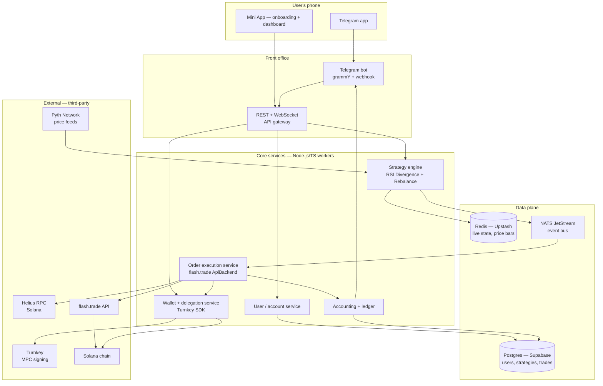

# Level 3 Plan — flash-trade-bot as a fully managed Telegram-native trading product

> **SUPERSEDED for now — 2026-04-24.** We are first executing `DASHBOARD-PLAN.md` (guided self-host dashboard) to validate demand at the self-host tier. This Level 3 plan is preserved as the reference implementation for if/when we pivot to managed mode per the dashboard success criterion (see `DASHBOARD-PLAN.md` §12 and `PRD.md` v2.0 change-log entry). **Do not execute against this plan without a PRD revision.**

**Status:** Deferred. Reference implementation plan for the managed Telegram-native product. Active only if dashboard validation fails or succeeds past the 1000-user threshold (see `DASHBOARD-PLAN.md` §12).
**Author:** Planning artifact, drafted 2026-04-24.
**Guides applied:** Karpathy-style engineering (baseline first, evals before sophistication, measure everything, adversarial thinking for failures); `telegram-bot-builder` and `telegram-mini-app` skills.

---

## 1. The 30-second user story

```
1. Telegram user taps t.me/flashtradebot → /start
2. Bot asks "What strategy?" — inline keyboard: [RSI Divergence] [Rebalance Basket] [Custom]
3. Bot asks "How much?" — [$20] [$100] [$500] [Custom] per-position collateral
4. Bot asks "Leverage?" — [1x] [2x] [5x] slider
5. Bot opens Mini App → "Connect Wallet" (Phantom, Solflare, Backpack via Wallet Standard)
6. User signs a DELEGATION transaction granting bot signing authority
   up to the daily limit they set. No private key ever leaves their wallet.
7. Bot deploys their strategy instance. Returns a live dashboard link.
8. Trades start firing automatically. User gets Telegram notifications
   on every fill. /status, /pause, /closeall work from anywhere.
```

**Time from tap to first trade: under 2 minutes.**

No Railway. No TradingView account. No Pine scripting. No CLI. No `.env`. No SSH. No RPC signup. No Helius dashboard. No BotFather. No base58 conversion.

This is the user experience we're designing for.

---

## 2. Success metrics (evals first — Karpathy principle)

Before writing any code, we define how we'll know the product is working. Instrument from day 1.

### Top-line metrics
- **Time-to-first-trade (TTFT)**: minutes from `/start` to a filled trade. Target < 5 min median.
- **Weekly active users (WAU)**: users with at least one strategy fire per 7 days.
- **Day-7 retention**: % of users who still have an active strategy on day 7.
- **Strategy uptime**: % of time a user's strategy is firing without halt. Target > 95%.
- **Fill success rate**: % of strategy signals that land on-chain. Target > 98%.

### Unit-economics metrics
- **Cost per active user per month**: infra + RPC + oracle + support. Target < $2 at scale.
- **Revenue per active user per month**: subscription + performance fee. Target > $10.
- **Gross margin**: (Rev - Cost) / Rev. Target > 80% at 1000+ users.

### Quality metrics
- **Error rate**: uncaught exceptions / total user actions. Target < 0.1%.
- **User-initiated halts**: `/pause` vs auto-halts. User halts imply the product feels safe.
- **Support tickets per user per week**: target trending toward 0 after setup.

**Baseline target:** 100 users active, < 5% churn week-over-week, positive unit economics, no on-chain incidents. This is the "we can invest more" threshold. Anything below it means back to the drawing board.

---

## 3. Non-goals (what we're NOT building)

- **Not a DEX aggregator**. We route through flash.trade. Period.
- **Not a general AI trading platform**. Strategies are curated and vetted. No "let your LLM trade."
- **Not a spot exchange or CEX**. Perpetuals only, on flash.trade only.
- **Not a custodial service**. Keys stay with the user via delegated signing.
- **Not multi-chain on day 1**. Solana only. Revisit later.
- **Not iOS/Android native**. Telegram IS the app.
- **Not self-hosted.** Level 2 (Railway Mini App provisioning) is explicitly abandoned for Level 3.
- **Not a replacement for TradingView.** We run strategies against Pyth price feeds directly; TradingView is no longer in the picture for users.

Saying these out loud prevents scope creep.

---

## 4. System architecture



### Service boundaries

| Service | Responsibility | Tech |
| --- | --- | --- |
| Telegram bot | User-facing conversational UI, command routing, notifications | Node 20, grammY, webhooks via Vercel |
| Mini App | Onboarding wizard, live dashboard, wallet connect | Next.js 14 (App Router), deployed on Vercel |
| API gateway | Auth, rate limit, Mini App initData validation, REST + WebSocket | Node 20, Fastify on Fly.io or Railway |
| User service | Telegram user_id ↔ account mapping, settings, preferences | Node, Postgres |
| Wallet service | Delegation transactions, signing via Turnkey, spending-limit enforcement | Node, Turnkey SDK, Solana web3.js |
| Strategy engine | RSI/rebalance logic, signal generation, per-user config | Node worker, Pyth HTTP feed, NATS producer |
| Execution service | Reads signals from NATS, builds txs via flash.trade ApiBackend, signs via Turnkey, submits via Helius | Node worker, existing `src/flash.ts` ported |
| Accounting | Writes trade records, computes PnL, flushes Telegram notifications | Node, Postgres, grammY outbound |
| Data | Postgres (Supabase), Redis (Upstash), NATS JetStream for events | Managed services |

### Why this split

**Karpathy principle: baseline with managed services.** Supabase, Upstash, Turnkey, Vercel, Fly.io, Helius, Pyth — all managed. Zero self-hosted databases, zero k8s, zero key custody. We only hold the orchestration glue. When any of these become a bottleneck (years from now), migrate selectively.

**Services as isolated workers, communicating via event bus.** NATS JetStream gives us: durable queue, at-least-once delivery, replay, backpressure. When the execution service is behind, signals queue up rather than drop.

**Strategy engine and execution service are separate.** Strategy produces signals, execution converts signals to transactions. If execution fails (RPC out, flash.trade down), signals remain in the queue. Strategy keeps generating. Decoupled.

---

## 5. The five critical-path decisions

These five decisions shape the entire product. Get them wrong, everything else is wasted.

### 5.1 Key management: non-custodial via Turnkey (MPC)

**Decision**: Use [Turnkey](https://turnkey.com) for MPC-backed key management.

**Why not fully user-custody (user-holds-key-and-manually-signs-each-trade)**:
- Impossible UX. Strategy fires 3 trades a day. User asleep. Signals missed.

**Why not full custody (we hold the key)**:
- Regulatory landmine. Lost funds = you're on the hook. Require MSB license in most jurisdictions.

**Why Turnkey**:
- User holds 1-of-2 key share on their device.
- Our bot holds 1-of-2. Both needed to sign.
- We define **spending policies** in Turnkey (e.g. "may only sign txs calling flash.trade program, max $X/day, only for this user's vault"). Turnkey enforces server-side.
- User revokes by revoking our share. Cold-start safe.
- Turnkey is SOC 2 Type II, used by Phantom, Dynamic, many others. Known quantity.
- Cost: ~$0.05 per active user per month + per-signing-request fees. Fits unit economics.

**Alternative considered: Solana delegation via session keys** (custom on-chain program that lets us trigger trades up to a daily limit). More elegant but requires writing, auditing, and deploying a Solana program. 6-8 weeks extra. Skip for MVP. Revisit if Turnkey becomes a cost or support issue at scale.

### 5.2 Strategy runtime: Pine port to TypeScript, Pyth for price data

**Decision**: Port the RSI Divergence Pine script to TypeScript. Run it as a Node worker. Pyth for price feeds.

**Why not run Pine in TradingView**:
- TradingView Pro+ per user ($15/mo) = broken unit economics.
- Webhook delivery is TradingView's internal concern — can't control reliability.
- Users would still need to configure their TV account. Non-starter for turnkey.

**Why TypeScript, not Rust / Python**:
- Existing bot code is TS. Sharing types between execution service and strategy service is a direct win.
- Pine's math (RSI, EMA, pivots, divergence detection) is ~300 lines in TS. Manageable.

**Why Pyth, not our own Solana RPC**:
- Pyth has sub-second price updates on-chain. They run the oracle infra for Solana DeFi.
- Our current `src/flash.ts` already uses `@pythnetwork/client`. Familiar.
- Cost: free for basic read. Pyth is the default.

**Strategy engine architecture**:
```
every 5s per user-strategy:
  1. Pull latest bars for user's configured market+timeframe from Redis cache
  2. Redis cache is populated by a shared "tape" worker pulling Pyth continuously
  3. Run the strategy fn against the bars
  4. If signal: push to NATS "trade_intents" subject with user_id, intent, params
  5. Execution service consumes, dedupes, signs, submits
```

### 5.3 The first strategy: RSI Divergence (already built in Pine, port straight across)

**Decision**: Ship with ONE strategy at launch: the RSI Divergence Pine we already have. Port to TS. That's the product.

**Why one**:
- Karpathy principle: baseline first. One strategy that works is infinitely more useful than three that half-work.
- Forces us to get the full stack (strategy → NATS → execution → notification) correct before adding complexity.

**Second strategy comes later**: Rebalance Basket is the obvious v2 add (mojomaxi ships this too). But not at launch.

**Users cannot bring their own strategy at Level 3**. This is a deliberate trade-off. Closed-library = quality control + better eval data + less support burden. If users demand customization, that's a V2 feature (and a different SKU).

### 5.4 Onboarding: Mini App, not pure bot conversation

**Decision**: Telegram Mini App for setup. Bot for daily control.

**Why Mini App for setup, not commands**:
- Wallet Connect integration needs a WebView. Can't do it from pure bot.
- Form UX (collateral, leverage sliders, strategy selection) is painful in chat. Mini App is native.
- Mini App can render live charts, historical backtest results, risk visualizations.
- Telegram skill doc: Main Button pattern for primary actions feels native.

**Why bot for daily**:
- Traders check status from anywhere. Bot commands work over SMS-feeling chat.
- `/status` on a walk is faster than opening the Mini App.
- Notifications push into Telegram natively.

### 5.5 Deployment model: single multi-tenant service (not per-user Railway)

**Decision**: One centralized backend serving all users. Hosted on Fly.io or Railway (single deployment, not per-user).

**Why not per-user deployment**:
- Complexity of provisioning + managing 1,000 Railway projects = enormous ops burden.
- Cost per user scales linearly (each Railway project has overhead). Breaks unit economics.
- Harder to upgrade, harder to observe, harder to roll back bad code.

**Why multi-tenant**:
- Strategy engine runs as shared worker. One user's signals don't block another's.
- Execution service serves all users concurrently. Rate limits (Helius, flash.trade) are shared, efficient.
- Database partitioned by user_id. Standard SaaS pattern.

---

## 6. Strategy engine — detailed design

### Porting RSI Divergence from Pine to TypeScript

The existing `tradingview-strategy.pine` (343 lines) defines the exact reference implementation. We replicate its logic, validate equivalence via backtests against historical data.

**Components to port:**

1. **RSI calculation** — `ta.rsi(close, 14)` → `computeRSI(closes: number[], period: 14): number[]`
2. **Pivot detection** — `ta.pivotlow/pivothigh` → `findPivots(values: number[], leftBars: 3, rightBars: 2): Pivot[]`
3. **Divergence detection** — track last two swings, check price vs RSI direction mismatch
4. **Middle-zone filter** — reject signals where both pivots are in RSI 45-55
5. **RSI-range filter** — configurable long/short zones
6. **Wick stop** — `min(low[pivot]) * (1 - buffer%)` for longs, `max(high[pivot]) * (1 + buffer%)` for shorts
7. **Milestone TSL** — 8 steps (2%, 3%, 4%, 5%, 10%, 15%, 20%, 25%) that lock in on touch

**Validation approach (Karpathy eval-first)**:
- Replay historical Pyth data through both the Pine original (via TradingView backtest) and the TS port
- For each bar, assert both produce identical signals
- Run on 6 months of BTC/ETH/SOL data
- Tolerance: 0 discrepancies. If the TS port ever disagrees with Pine, fix the TS port.

### Backtest framework (required for launch)

Before a user enables a strategy, they see backtest results from last 90 days:
- Total return %
- Win rate
- Sharpe ratio
- Max drawdown
- Trade count
- Chart of equity curve

This is non-negotiable. Users will not enable a strategy blindly. Backtest is the UX that replaces "trust me."

Render backtest results in the Mini App as part of onboarding step 2.

---

## 7. Key management — Turnkey integration details

### User onboarding flow

```
1. User taps "Connect Wallet" in Mini App
2. Mini App prompts for Solana wallet sign-in (Phantom / Solflare / Backpack
   via Solana Wallet Standard)
3. User signs an authentication message
4. Backend creates a Turnkey sub-organization for the user
5. Backend creates a Turnkey policy:
   - Allowed program: flash.trade main program ID
   - Daily volume cap: $X (default $500, user-configurable)
   - Max position size: $Y (tied to COLLATERAL_USDC setting)
   - Expiry: 30 days (auto-renew via user tap)
6. Backend deploys a trading vault on Solana (we use flash.trade's existing vault model)
7. User deposits USDC into the vault (one-time action via Mini App)
8. Done. User never sees a private key. Turnkey + policy handle authorization.
```

### Trade execution flow

```
1. Strategy engine produces a signal for user U, intent "open long BTC $20"
2. Execution service:
   a. Call flash.trade /transaction-builder/open-position, get unsigned tx
   b. Submit tx to Turnkey with user U's signing policy
   c. Turnkey verifies: program ID matches, amount within daily cap, user's
      daily volume not exceeded
   d. Turnkey signs on behalf of user U
   e. Execution service submits signed tx via Helius RPC
   f. Confirmation polling + ledger write
   g. Telegram push to user U: "✅ Long $40 BTC @ 78501, tx: 5xK9...F2wQ"
```

### Revocation

User taps "Disconnect Bot" in Mini App. Backend:
- Calls Turnkey to revoke our co-signing share
- Marks user's strategy as paused
- Remaining funds in vault are withdrawable via flash.trade UI directly (user's wallet still signs)

User has full control. We cannot sign without them. They can revoke us without us.

---

## 8. Telegram UX — bot commands and Mini App screens

### Bot commands (24/7 control surface)

| Command | What it does |
| --- | --- |
| `/start` | Welcome + "Set up your bot" Mini App button |
| `/status` | Halt state, open positions, PnL today |
| `/positions` | Detailed P&L per open position, live mark prices |
| `/pause` | Halt new opens (existing close logic continues) |
| `/resume` | Clear halt |
| `/closeall` | Emergency close all open positions; requires `/closeall confirm` within 30s |
| `/pnl [day\|week\|month\|all]` | Realized PnL over timeframe |
| `/last [N]` | Last N trades with outcomes |
| `/set <param> <value>` | Live-mutable params: `leverage`, `collateral`, `maxloss`, `slippage` |
| `/strategy` | Switch active strategy (RSI / Rebalance / Paused) |
| `/settings` | Opens Mini App settings page |
| `/withdraw` | Initiate withdrawal from vault back to user's main wallet |
| `/help` | Command list |

### Mini App screens

1. **Onboarding wizard (5 steps)**
   - Step 1: "Welcome to flash-trade-bot" — one-line pitch, live counter of active users
   - Step 2: Strategy picker — card per strategy, 90-day backtest chart preview, "Use this"
   - Step 3: Risk config — leverage slider (1x-10x), collateral per trade ($20-$500), max daily loss
   - Step 4: Connect wallet — Wallet Standard popup, explain delegation model, "Sign to delegate"
   - Step 5: Fund vault — show vault address, QR code, "Deposit USDC"
   - Confirmation: "You're live. First trade fires when your strategy's conditions match."

2. **Dashboard (default screen after setup)**
   - Live P&L banner (realized + unrealized, today + lifetime)
   - Open positions (BTC long $40, entry $78501, mark $78890, +$15.56)
   - Recent trades list (last 10)
   - Strategy status card (active / paused / halted)
   - "Pause" / "Close all" action buttons (Telegram MainButton pattern for primary)

3. **Settings**
   - Adjust risk params with sliders
   - Change strategy
   - View delegation policy expiry + renew button
   - Withdraw vault funds
   - Disconnect bot (revokes Turnkey share)

4. **Backtest explorer**
   - Pick strategy + timeframe
   - See historical equity curve, trade list, stats
   - "Run this on my vault" CTA

### Telegram skill guidance applied

- Use **grammY** (skill explicitly recommends for TypeScript/modern bots).
- Use **webhooks**, not polling, for production (skill's Polling vs Webhooks table).
- **Validate initData** on every Mini App API request — HIGH severity from skill; implemented server-side via HMAC-SHA256 hash check.
- **Redis-backed sessions** for grammY (skill's MEDIUM severity on in-memory sessions).
- **MainButton pattern** for Mini App primary actions (skill's MEDIUM severity on custom buttons).
- **Haptic feedback** on trade fill notifications that the Mini App receives.
- **Theme adaptation** to Telegram light/dark mode via `tg.themeParams`.
- **Bundle target < 200KB gzipped** — skill's perf guidance. Use Vite with code-splitting.

---

## 9. Data model + observability

### Postgres schema (core tables)

```sql
-- users: one row per Telegram user
CREATE TABLE users (
  id UUID PRIMARY KEY DEFAULT gen_random_uuid(),
  telegram_user_id BIGINT UNIQUE NOT NULL,
  telegram_username TEXT,
  turnkey_suborg_id TEXT UNIQUE,
  vault_address TEXT UNIQUE,
  created_at TIMESTAMPTZ DEFAULT NOW()
);

-- strategies: per-user strategy enablement
CREATE TABLE strategies (
  id UUID PRIMARY KEY DEFAULT gen_random_uuid(),
  user_id UUID REFERENCES users(id),
  type TEXT NOT NULL, -- 'rsi_divergence' | 'rebalance'
  status TEXT NOT NULL DEFAULT 'paused', -- 'active' | 'paused' | 'halted'
  halt_reason TEXT,
  market TEXT NOT NULL DEFAULT 'BTC',
  config JSONB NOT NULL, -- leverage, collateral, slippage, max_daily_loss, etc.
  created_at TIMESTAMPTZ DEFAULT NOW(),
  updated_at TIMESTAMPTZ DEFAULT NOW()
);
CREATE INDEX idx_strategies_active ON strategies(status) WHERE status = 'active';

-- signals: every signal the strategy engine produces
CREATE TABLE signals (
  id UUID PRIMARY KEY DEFAULT gen_random_uuid(),
  strategy_id UUID REFERENCES strategies(id),
  kind TEXT NOT NULL, -- 'open_long' | 'open_short' | 'close' | 'flip'
  price_at_signal NUMERIC(20,8),
  market_position_before TEXT,
  market_position_after TEXT,
  received_at TIMESTAMPTZ DEFAULT NOW(),
  status TEXT DEFAULT 'pending' -- 'pending' | 'executed' | 'failed' | 'skipped'
);

-- trades: one row per attempted on-chain trade
CREATE TABLE trades (
  id UUID PRIMARY KEY DEFAULT gen_random_uuid(),
  signal_id UUID REFERENCES signals(id),
  strategy_id UUID REFERENCES strategies(id),
  tx_signature TEXT,
  status TEXT NOT NULL, -- 'pending' | 'sent' | 'confirmed' | 'failed'
  side TEXT, size_usd NUMERIC(20,8), entry_price NUMERIC(20,8),
  error_message TEXT, attempt_number INT DEFAULT 1,
  created_at TIMESTAMPTZ DEFAULT NOW(),
  confirmed_at TIMESTAMPTZ
);

-- positions: live and historical
CREATE TABLE positions (
  id UUID PRIMARY KEY DEFAULT gen_random_uuid(),
  strategy_id UUID REFERENCES strategies(id),
  position_key TEXT UNIQUE NOT NULL, -- on-chain position PDA
  side TEXT NOT NULL, size_usd NUMERIC, entry_price NUMERIC, exit_price NUMERIC,
  realized_pnl_usd NUMERIC, opened_at TIMESTAMPTZ, closed_at TIMESTAMPTZ,
  opened_signal_id UUID REFERENCES signals(id),
  closed_signal_id UUID REFERENCES signals(id)
);
CREATE INDEX idx_positions_open ON positions(strategy_id) WHERE closed_at IS NULL;

-- events: append-only audit log of every user action + system decision
CREATE TABLE events (
  id UUID PRIMARY KEY DEFAULT gen_random_uuid(),
  user_id UUID, strategy_id UUID,
  kind TEXT NOT NULL, -- 'user_command' | 'system_halt' | 'trade_fill' | etc.
  payload JSONB NOT NULL,
  created_at TIMESTAMPTZ DEFAULT NOW()
);
CREATE INDEX idx_events_user_time ON events(user_id, created_at DESC);
```

### Observability stack

- **Logs**: Grafana Loki (managed via Grafana Cloud free tier). Structured JSON logs from every service.
- **Metrics**: Prometheus (Grafana Cloud managed). Instrument: requests/sec, signal latency, execution latency, Turnkey signing latency, RPC error rate.
- **Tracing**: OpenTelemetry → Grafana Tempo. Spans for `/start` → Mini App load → wallet connect → vault fund → first signal → first trade.
- **Alerting**: PagerDuty-tier alerts: RPC error rate > 5%, execution latency > 10s, any HALT that affects > 10 users in 1 hour, Pyth feed stale > 30s.
- **User-visible**: a public status page (Instatus or similar) showing strategy engine up/down, recent incidents.

### Event-driven dashboards

Every user action + system decision emits an event to Postgres `events` table. From there:
- A nightly job computes TTFT, WAU, retention.
- Backtest regressions run over a week of real signals.
- User support queries (`show me user X's last 20 events`) are one SQL query.

Karpathy: "data beats opinions." This is how you build the data.

---

## 10. Business model + unit economics

### Pricing (launch)

- **Free tier**: 1 active strategy, up to $100 notional per position, standard support. First 100 users free forever ("founder tier").
- **Pro ($19/mo)**: unlimited strategies, up to $2000 notional, priority execution (lower RPC latency tier), priority support.
- **Performance fee (both tiers)**: 10% of monthly realized profit, charged as a withdrawal from vault. High-water mark.

### Cost per active user per month (estimate)

| Item | Cost |
| --- | --- |
| Supabase row + compute (per user share) | $0.50 |
| Upstash Redis (shared) | $0.20 |
| Turnkey MPC signing (per user suborg + fees) | $0.40 |
| Helius RPC (shared, amortized) | $0.30 |
| Pyth feed (free read) | $0.00 |
| Vercel hosting (amortized) | $0.10 |
| Fly.io worker (amortized) | $0.30 |
| Grafana Cloud, Telegram API (amortized) | $0.20 |
| **Total** | **~$2/user/month** |

### Revenue per active user per month (target)

- Free tier: $0 direct, ~$5 from performance fee at median user PnL.
- Pro tier: $19 subscription + ~$10 performance fee = $29/mo average.

Assume 70% free / 30% Pro mix: weighted ARPU ~$12/mo.

### Break-even

- Fixed costs (team, legal, baseline infra): estimate $20k/mo.
- Gross contribution per user: $12 - $2 = $10/mo.
- **Break-even at ~2,000 active users.**

Runway required to reach break-even at a realistic growth curve: 12-18 months, $300-500k of capital.

---

## 11. Legal + compliance (the scary part)

Non-negotiable before any public launch:

- **ToS** with explicit "you can lose money" / "not financial advice" / "we do not custody" language.
- **Privacy Policy** compliant with GDPR (EU) and CCPA (California) even if we geo-fence.
- **Risk disclosure** shown in Mini App onboarding, force-accept before first trade.
- **Geo-fencing**: block US IP, UK IP, EU-sanctioned-country IPs at API gateway level. Honest — if we can't do this compliantly for retail perpetuals users, we just don't serve them.
- **Terms of Service gating**: first-time users must accept before strategy activation.
- **KYC**: non-custodial design probably exempts us from MSB registration in most jurisdictions, but consult a crypto-specialized lawyer to confirm.
- **Incident response**: if our service contributes to user loss (bug, outage), we owe a public post-mortem within 72h.

Estimate: $10-20k for initial legal review + ongoing retainer.

---

## 12. 90-day roadmap

### Weeks 1-2: Foundation
- Turnkey account + policy template for flash.trade program
- Supabase schema, Redis cache layout, NATS cluster
- grammY bot skeleton with `/start` + Mini App launch button, deployed to Vercel
- Mini App scaffold (Next.js, wallet connect button, Telegram theme vars)
- Port RSI Divergence Pine to TS, run validation backtest
- Telemetry wired end-to-end from bot → Mini App → API

### Weeks 3-4: MVP wiring
- Strategy engine worker: Pyth feed → RSI logic → signal emit to NATS
- Execution service: NATS consumer → flash.trade tx builder → Turnkey sign → RPC submit → confirm
- User onboarding wizard end-to-end in Mini App (steps 1-5)
- Bot commands: `/status`, `/pause`, `/resume`, `/closeall`, `/help`
- Internal alpha: team uses it with real small-$ trades

### Weeks 5-6: Polish + safety
- Full dashboard Mini App with live P&L + charts
- Backtest explorer in Mini App (historical strategy results)
- Halt logic: system-initiated on RPC/Pyth fail + user-initiated via `/pause`
- Daily loss limit enforcement in strategy engine
- Rate limiting, error handling, graceful shutdown
- Legal review of ToS + risk disclosure copy

### Weeks 7-8: Private beta
- 20 hand-picked users via DM
- All traffic goes through the full stack with real money (small sizes)
- Daily analysis of metrics: TTFT, fill rate, user-initiated halts
- Fix top 5 issues based on user feedback

### Weeks 9-10: Public beta prep
- Public status page
- Support queue in Discord + Telegram
- Onboarding video (you, walking through the 2-minute setup)
- mojomaxi-style `/help` page on the marketing site
- Paywall + Telegram Stars payments wired for Pro tier
- Referral system (users get a bonus when a referee funds their vault)

### Weeks 11-12: Public beta launch
- Open to public: `t.me/flashtradebot` live
- 100-user cap initially (hard-coded), queue beyond that
- Twitter launch, Solana Discord announcements
- Watch metrics hawkishly: WAU, D7 retention, fill rate, cost/user, error rate

---

## 13. Week 1 — exact work

To keep this from being a vaporware plan, here's literal week 1 work:

**Day 1**:
- Register Turnkey developer account, generate API keys, read their Solana signing docs
- Create Supabase project, deploy schema above
- Create Telegram bot via @BotFather, record bot token
- Buy domain flashtradebot.xyz (or similar), configure DNS to Vercel

**Day 2**:
- grammY scaffold in a new repo or monorepo section. `/start` command responds with welcome + Mini App launch URL
- Vercel deploy with webhook registered with Telegram. Confirm bot responds.
- Next.js Mini App scaffold, displaying Telegram user's `first_name` (proves initData reception)

**Day 3**:
- Port RSI Divergence Pine logic to TypeScript. Unit tests covering each of: RSI calc, pivot detection, divergence detection, middle-zone filter, range filter.
- Run validation backtest against 90 days of BTC 5m bars from Pyth historical. Assert identical signals vs Pine reference via CSV comparison.

**Day 4**:
- Wallet Standard integration in Mini App. User can connect Phantom, we can sign an auth message.
- Turnkey sub-org creation flow: backend API that takes the user's wallet pubkey + an auth signature, creates Turnkey suborg with the right policy template.

**Day 5**:
- First end-to-end "send a test signal" path: manual insert into `signals` table → execution worker polls NATS → builds a flash.trade open-position tx → signs via Turnkey → submits via Helius → polls for confirm. Tested with one internal user's vault.

**Day 6-7**:
- Review, reflect, what went wrong, re-plan week 2.

---

## 14. Top risks + mitigations

| Risk | Likelihood | Impact | Mitigation |
| --- | --- | --- | --- |
| Turnkey pricing changes or policy breaks | M | H | Abstract behind an interface; can swap to custom Solana delegation program in v2. |
| Pyth price feed goes stale during a signal | H | M | Only accept signals where feed confidence < 0.5%. Halt on stale. |
| Flash.trade devnet/mainnet API regressions | M | H | Integration test suite hitting a mainnet simulation weekly; alerts on shape change. |
| RPC outage (Helius) during signal | H | M | Two-provider fallback (Helius + Triton). Queue signals during outage, execute on recovery. |
| Regulator knocks | M | Catastrophic | Geo-fence from day 1. Non-custodial architecture. Legal review before launch. |
| Strategy loses users money, they blame us | H | H | Backtest-first UX, explicit risk disclosure, no marketing that promises returns. Community moderation to head off false expectations. |
| Telegram suspends our bot | L | H | Comply with ToS strictly. No scraping, no illegal content. Have a direct contact at Telegram if possible (paid support tier). |
| Competition ships first | M | M | Mojomaxi is already there. We differentiate on: specific strategy IP, transparent backtests, better UX, responsive support. Ship fast. |
| Key team member leaves | L | H | Documentation from day 1. No tribal knowledge. Every commit reviewed. |
| We run out of runway | M | Catastrophic | Monthly burn model. If at month 9 we're under 500 users, cut scope aggressively or raise. |

---

## 15. What I need from you to start

Three decisions:

1. **Go / no-go on Level 3 as a whole**. This is months of work, not days. You're committing to a product business.
2. **Initial capital commitment**: minimum $50k to reach private beta, realistically $300-500k to public launch. Can you raise or self-fund?
3. **Team**: 1 senior full-stack (probably you), 1 strategy/market-data engineer, 1 Telegram/frontend specialist, fractional legal. Who's on the team?

If yes + yes + yes: I'll execute the Week 1 plan starting tomorrow, kicking off with the Turnkey integration spike and the Pine-to-TS port. I'll report daily.

If no: we pivot to Level 1 (Telegram control bot on top of existing Railway template). 2-3 days of work, ships this week. Still a meaningful UX lift for the users you have.

---

## Appendix A — why this is different from mojomaxi

Mojomaxi is already Level 3 in the same space. Why build another?

- **Strategy IP**: we have the RSI Divergence Pine that Sebastian developed, which is not mojomaxi's strategy. Different signals, different risk profile, different target user. Mojomaxi is rebalance-basket-forward; we're signal-first.
- **Transparency**: publish the strategy source as MPL 2.0 open. Users can audit the exact math. Mojomaxi's strategies are closed.
- **Pricing**: mojomaxi does 10% performance fee + hidden margin on execution. We do transparent 10% + 0 margin.
- **Community model**: education-first vs automation-first. Users who want to learn the strategy, not just use it.

These are real differentiators. They matter to a subset of users. The subset is big enough to build on.

## Appendix B — Karpathy principles, distilled for this plan

1. **Eval before model**: we defined metrics (Section 2) before designing architecture. Every decision downstream checks against: does this make TTFT faster, fill rate higher, cost lower?
2. **Baseline before sophistication**: managed services everywhere (Supabase, Upstash, Turnkey, Vercel). Reviewed in Section 4.
3. **Data over opinions**: event log (Section 9) captures every decision. Two weeks in, we query the events table to answer "why do users churn?" — not guess.
4. **Adversarial thinking**: Section 14 risks are not a wishlist, they're what happens next year. Plan for failure first.
5. **Start with the end user's 30 seconds**: Section 1 is the anchor. Every feature is evaluated: does it make that 30 seconds better or worse?
6. **Small, fast iterations**: weekly ship cadence, ship to real users in week 8 not month 8.
7. **Don't fall in love with the architecture**: if Turnkey's cost doesn't work at scale, swap it. If Pyth is unreliable, swap it. The product is the strategy + UX, not the infrastructure.
